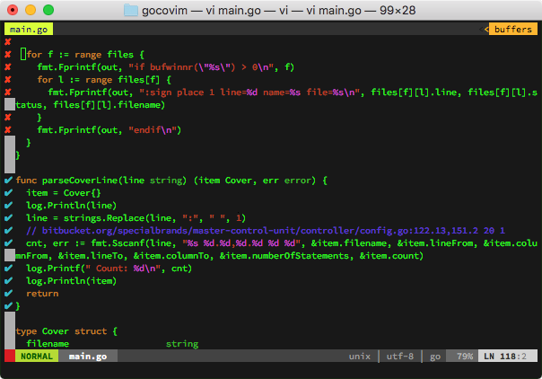

# Go Coverage for VIM `gocovim`

`gocovim` can be used to display the current code coverage for your go project in your `vim` editor.



## Installation

If you don't have a preferred installation method, one option is to install pathogen.vim, and then copy and paste:

```bash
cd ~/.vim/bundle
git clone https://github.com/webhat/gocovim.git
vim -u NONE -c "helptags gocovim/doc" -c q
```

Now run `make install` to install the `gocovim` binary

## Usage

To use run tests with coverage, or have a coverage file `cover.out` generated by your TTD tool.

```bash
go test -coverprofile cover.out
```

You can run `<leader>r` from `vim` or run `gocovim` from the commandline to produce your coverage file.


Credits
=======
Inspired by [cadre](https://github.com/nyarly/cadre/)

